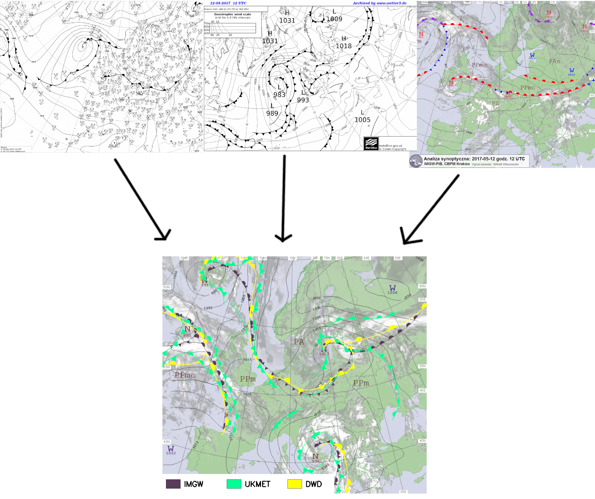
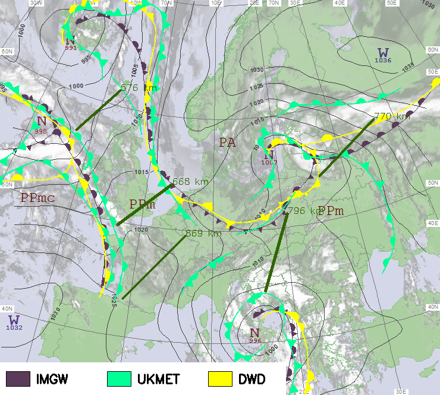

# Generacja_map_laczonych.py
Script for few in one weather map fusion. It proper rotates and scale maps to match each other, after that extracts weather fronts from them and inserts it in different colors in fused map.

# Pomiar_odleglosci.py
Script for approximated distance measurement in km at fused weather map. It's important to know that distance at image depends on longitude of place of measurement.

